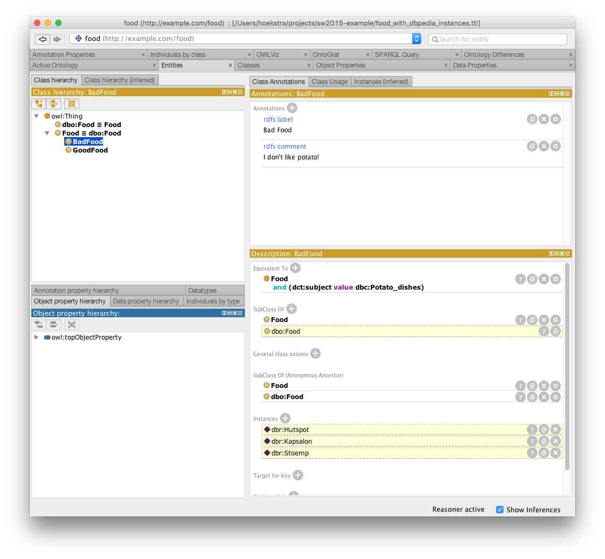
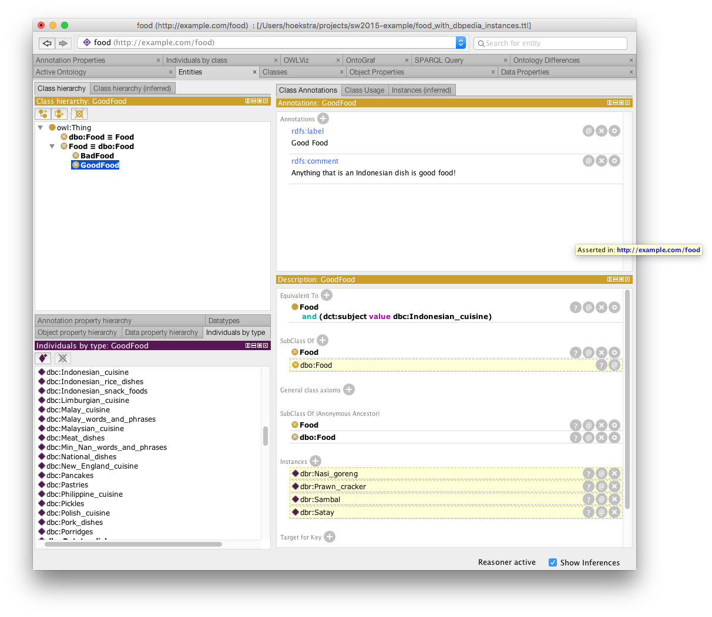

I want to build an application that categorizes DBPedia food into GoodFood and BadFood.

My ontology uses the DBPedia ontology to define the two classes. The first question is: what is good food and what is bad food, according to me?

First, let's define our namespaces:

```
@prefix : <http://example.com/food#> .
@prefix dbc: <http://dbpedia.org/resource/Category:> .
@prefix dbo: <http://dbpedia.org/ontology/> .
@prefix dct: <http://purl.org/dc/terms/> .
@prefix owl: <http://www.w3.org/2002/07/owl#> .
@prefix rdf: <http://www.w3.org/1999/02/22-rdf-syntax-ns#> .
@prefix xsd: <http://www.w3.org/2001/XMLSchema#> .
@prefix rdfs: <http://www.w3.org/2000/01/rdf-schema#> .
```

Then, let's look at food. Every type of food in DBPedia has an `rdf:type` relation with `dbo:Food`. And it also has a `dct:subject` relation with a category of types of dishes, e.g. `dbc:Dutch_cuisine`.

Well, suppose I don't like any potato dish. DBPedia has a category <http://dbpedia.org/resource/Category:Potato_dishes> for all dishes that contain potato.

So, I can define my class of BadFood as follows:

```
:BadFood rdf:type owl:Class ;
         rdfs:label "Bad Food" ;
         owl:equivalentClass [ rdf:type owl:Class ;
                               owl:intersectionOf ( :Food
                                                    [ rdf:type owl:Restriction ;
                                                      owl:onProperty dct:subject ;
                                                      owl:hasValue dbc:Potato_dishes
                                                    ]
                                                  )
                             ] ;
         rdfs:subClassOf :Food ;
         rdfs:comment "I don't like potato!" .
```

This states that any thing that is a `:Food`, and has `dbc:Potato_dishes` as value for the `dct:subject` property, will be inferred as belonging to the class of `:BadFood`.

Let's try this out.

DBPedia has the food `dbr:Hutspot` that has the `dct:subject` `dbc:Potato_dishes`:

```
dbr:Hutspot   rdf:type      dbo:Food ;
              dct:subject   dbc:Potato_dishes .
```

If I now add these two triples to my Stardog triplestore (or to Protege), nothing special will happen, because I have not yet specified that `dbo:Food` is equivalent to my own food class `:Food`:

```
dbo:Food      owl:equivalentTo  :Food .
```

Given that I now know that any `dbo:Food` also belongs to `:Food`, and that `:BadFood` is the subset of all `:Food` that has the value `dbc:Potato_dishes` for the `dct:subject` property, and that `dbr:Hutspot` is a `dbo:Food` with exactly that category as subject, I can infer that:

```
dbr:Hutspot   a       :BadFood .
```

You can see what this looks like in Protege in the screenshot:


Because I merged part of the ontology of DBPedia with mine (just the food class), and used DBPedia URIs in my class definitions, I can now automatically categorize **all** potato dishes as bad food.

Let's try this out with some more data.

First I try a [SPARQL query that gives me all information about Dutch foods](http://yasgui.org/short/4kI4Lw1el):

```
PREFIX rdf: <http://www.w3.org/1999/02/22-rdf-syntax-ns#>
PREFIX rdfs: <http://www.w3.org/2000/01/rdf-schema#>
PREFIX dbo: <http://dbpedia.org/ontology/>
PREFIX dbr: <http://dbpedia.org/resource/>
SELECT * WHERE {
  ?sub dbo:origin dbr:Netherlands .
  ?sub a dbo:Food .
}
```

This gives us the following results (and more): `dbr:Tompouce, dbr:Poffertjes, dbr:Vla, dbr:Hachee, dbr:Stroopwafel, dbr:Apple_butter, dbr:Moorkop, dbr:Kruidnoten, dbr:Tiger_bread, dbr:Zoervleis, dbr:Pannekoek, dbr:Boerenjongens, dbr:Stoemp, dbr:Stip_(dish), dbr:Vlaai, dbr:Roze_koek`. Nice!

However, to be able to combine this DBPedia information with our ontology, we need to get back results in RDF. We use a [CONSTRUCT query to do this](http://yasgui.org/short/VJhf5D1xe) that takes the `dct:subject` relation to categories into account as well:

```
PREFIX rdf: <http://www.w3.org/1999/02/22-rdf-syntax-ns#>
PREFIX rdfs: <http://www.w3.org/2000/01/rdf-schema#>
PREFIX dbo: <http://dbpedia.org/ontology/>
PREFIX dbr: <http://dbpedia.org/resource/>
PREFIX dct: <http://purl.org/dc/terms/>

CONSTRUCT {  
  ?sub dbo:origin dbr:Netherlands .
  ?sub a dbo:Food .
  ?sub dct:subject ?category .
} WHERE {
  ?sub dbo:origin dbr:Netherlands .
  ?sub a dbo:Food .
  ?sub dct:subject ?category .
}
```

Note that we just copy the contents of the `WHERE` clause to the `CONSTRUCT` clause. We could also have rewritten it to e.g. produce instances of type `:Food` rather than `dbo:Food`. This is not needed since we have the equivalent class relation between the two classes.

We then get results such as:

```
dbr:Poffertjes	rdf:type	dbo:Food ;
	dbo:origin	dbr:Netherlands ;
	dct:subject	dbc:Pancakes ,
		dbc:Indonesian_snack_foods ,
		dbc:Dutch_cuisine ,
		dbc:Dutch_words_and_phrases ,
		dbc:Snack_foods .
dbr:Vla	rdf:type	dbo:Food ;
	dbo:origin	dbr:Netherlands ;
	dct:subject	dbc:Custard_desserts ,
		dbc:Dairy_products ,
		dbc:Dutch_cuisine ,
		dbc:Dutch_words_and_phrases .
```

Le's copy and paste the results from YASGUI to the `food.ttl` file that we created (actually... to the `food_with_dbpedia_instances.ttl` file).

If we then open the file again in Protege, and run the reasoner, the result is the following:



You can see that now also `dbr:Kapsalon` and `dbr:Stoemp` are categorised as `:BadFood`.

Adding a `:GoodFood` class that holds all dishes that belong to the category `dbc:Indonesian_cuisine` is now almost effortless:



## Stardog & Web Application

This is the basis of a Semantic Web application. You use your ontology and mappings to an external ontology (here DBPedia) to automatically classify data (instances) that you pull in via a SPARQL query.

We used Protege in this case to show the inferences, but the basics are the same if you use Stardog as well (or any other reasoning-enabled triplestore). Triple stores are much more scalable than Protege is.

If you look at the [tutorial](https://github.com/RinkeHoekstra/sw2015-tutorial.git), you can see that Step 11 implements this process on top of Stardog: you type a SPARQL CONSTRUCT query against DBPedia, and the results are pushed to your Stardog triplestore. If you also have your ontology in Stardog (as you did in Assignment 4), you can then query the triple store for the inferred triples as in Step 14.

Try by uploading the `food.ttl` file to Stardog, and using the SPARQL CONSTRUCT query above to generate the triples.

You can then query your local endpoint for the inferred results as follows (make sure reasoning is enabled):

```
PREFIX food: <http://example.com/food#>

SELECT ?food WHERE {
  ?food a food:BadFood .
}
```

You will get the same results as the ones you saw in the Protege interface.

In essence this is almost everything that is minimally required for the implementation part of the Final Project assignment. You need one more external dataset, you need to think about what you want to present to your users, and how you want to use inferencing to show interesting stuff. 

The more of this technical process is hidden to your users, the better, but it is not a strict requirement for getting a good grade! It is fine if getting your application to show nice results requires a bit of button-clicking and pasting SPARQL. queries.
